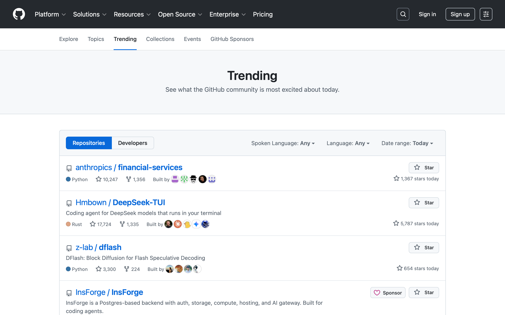

# vibesurfer (`vs`)

A real browser, exposed for agents.

The control surfaces in the agent stack today are mostly Chrome attached to DevTools, with a Python or TypeScript driver pretending to be a person clicking around. Playwright and CDP both started from "let a tool drive the same browser a developer's debugger drives" and inherited every bit of the developer ergonomics: huge JSON payloads on every read, an HTML accessibility snapshot a thousand nodes deep, no idea what's stale, no replay, no audit. Agents don't need any of that. What an agent needs from a browser is a typed accessibility tree it can plan against, refs that survive a re-render, a state token that rejects writes against a stale view, a delta on the next view instead of the whole tree, and a row in an audit table for every action. vibesurfer is built around those, and the engine is real WebKit underneath — `WKWebView` on macOS, `WebKitGTK 6` on Linux, `WebView2` on Windows — not a headless Chromium acting as a stand-in.

## What's the deal

```
$ vs session-open
@a99b04d877149e57
s_019e02cbc63270639c3f0b2e

$ vs open https://github.com/trending
@a99b04d877149e57
p_019e02cbcf907721a8231716

$ vs view p_019e02... | head -20
@a99b04d877149e57
1 doc "Trending repositories on GitHub today · GitHub"
  9 hdr ""
    14 nav "Skip to content"
    17 nav "Sign in"
  44 mn ""
    65 hd Trending
    66 p "See what the GitHub community is most excited about today."
    113 lst ""
      121 li "anthropics / financial-services"
      ...

$ vs capture p_019e02...
@a99b04d877149e57
~/.vibesurfer/captures/wk-1-1778163378824.png
```

That's a real `WkBackend` rendering `github.com/trending`, not a fixture, not a stub:



The accessibility tree above is what `vs view` returns. About a tenth the bytes of Playwright's accessibility snapshot for the same page; refs `9`, `121`, `66` survive across snapshots so a planned sequence of clicks doesn't fall apart on the second tick; the `@a99...` token at the top of every response is what your next write has to thread to be accepted.

## Why each piece

- **One real browser per platform.** Real `WKWebView` on macOS via `objc2`, real `WebKitGTK 6` on Linux via `webkit6`, real `WebView2` on Windows via `webview2-com`. No headless-Chromium-via-CDP layer between the agent and the page. The page sees what a user's browser would see; the agent sees a typed tree of it.
- **State tokens, not retries.** Every write requires the page's current `state_token` and gets rejected on stale; the rejection carries the new tree so you reconcile in one round trip instead of pre-reading every time. Read-then-write is unnecessary.
- **Tree deltas as the default view.** First `vs view` is a full tree; subsequent views are op-streams against the last-emitted tree for `(page, agent)`. Token cost stays flat as a long-lived page mutates.
- **Refs that mean something.** A button that survives a re-render keeps the same `Ref(N)` across snapshots. Multi-step plans don't have to rediscover the world after every action.
- **Idempotent actions.** `vs_act` keys on `(page, before_token, args_hash)` for 30 seconds; repeating on flake is free, no doubled clicks.
- **Composite reads.** `vs open --view`, `vs view --layout=N,M`, `vs view --read=N`, `vs act --view`, `vs wait --view` collapse the canonical two-call sequences into one wire frame. The protocol decided observation-driven composites belong on the wire side, not the agent side.
- **Audit by construction.** Every primitive writes one row to the `actions` table before returning. Replay, debugging, compliance, postmortems — they all want the same table, and there's no opt-out.
- **Persistent encrypted auth.** `vs auth save` dumps cookies + storage + IndexedDB metadata as an AES-256-GCM blob keyed by an OS-keyring secret (or a fallback keyfile). Survives daemon restarts; never sent off-machine.
- **Inspector capture, on by default.** `vs inspect console|network|request|eval|storage|scripts|script|dom|performance` reads from per-page ring buffers populated by a JS bridge installed at document-start. The capability flags are computed from runtime install state, not declared — if the bridge fails to register on a page, the wire returns `! ENGINE_UNSUPPORTED` cleanly instead of an empty buffer.
- **One self-contained binary.** `vs` is the client. `vs serve` is the daemon (auto-spawned on first call). `vs mcp` is the MCP server for Claude Desktop / Cursor / Codex / Gemini. `vs skill install` configures every detected agent on the host in one shot.

## Install

Homebrew (macOS, Linux):

```sh
brew tap frane/tap
brew install vibesurfer
```

curl (any host with a working Rust toolchain):

```sh
curl -sSL https://raw.githubusercontent.com/frane/vibesurfer/main/install.sh | sh
```

From source:

```sh
cargo install --git https://github.com/frane/vibesurfer.git vs-cli
```

System deps: nothing on macOS (system WebKit). On Linux: `libwebkitgtk-6.0-dev`, `libgtk-4-dev`, `libsoup-3.0-dev`. On Windows: the WebView2 Runtime (preinstalled on Windows 11; bundled with modern Edge).

## Wiring it into your agent

```sh
vs skill install
```

`vs skill install` walks every agent it can detect on the host and writes both the **skill** and the **MCP** surface in one shot. Each agent has its own conventions, and you don't have to know any of them:

| Agent | Skill | MCP config | Format |
|---|---|---|---|
| Claude Code | `~/.claude/skills/vibesurfer/SKILL.md` | `~/.claude.json` | JSON |
| Claude Desktop | — (use Claude Code) | `Library/Application Support/Claude/claude_desktop_config.json` | JSON |
| Codex CLI | `~/.codex/skills/vibesurfer/SKILL.md` | `~/.codex/config.toml` | TOML |
| Cursor | `<workspace>/.cursor/skills/vibesurfer/SKILL.md` | `<workspace>/.cursor/mcp.json` | JSON |
| Gemini | `~/.gemini/extensions/vibesurfer/GEMINI.md` + manifest | `~/.gemini/settings.json` | JSON |
| OpenClaw | `~/.openclaw/workspace/skills/vibesurfer/SKILL.md` | — | — |
| Canonical | `~/.agents/skills/vibesurfer/SKILL.md` | — | — |

Every MCP entry written has the same shape — `{"command": "vs", "args": ["mcp"]}` — and runs the JSON-RPC server out of the same `vs` binary you already have. Detection uses the agent's config dir or its CLI on `PATH`; an agent that isn't installed is reported as skipped, not failed. The canonical `~/.agents/` location is always written so any cross-client convention picks it up.

```
$ vs skill install
  ✓ agents          skill → ~/.agents/skills/vibesurfer/SKILL.md
  ✓ claude          skill → ~/.claude/skills/vibesurfer/SKILL.md
                    mcp   → ~/.claude.json
  ✓ claude-desktop  mcp   → ~/Library/Application Support/Claude/claude_desktop_config.json
  ✓ codex           skill → ~/.codex/skills/vibesurfer/SKILL.md
                    mcp   → ~/.codex/config.toml
  - cursor          skipped (not installed)
  ✓ gemini          skill → ~/.gemini/extensions/vibesurfer/GEMINI.md
                    mcp   → ~/.gemini/settings.json
  ✓ openclaw        skill → ~/.openclaw/workspace/skills/vibesurfer/SKILL.md
5 skill files, 4 MCP entries written across 6 detected agents.
```

You still have to tell the agent to use it — *"use vs for browser work"* in your system prompt is enough. Without that, agents fall back to their built-in tools out of habit even with the skill installed.

## A real session

Sign in to a SaaS, scrape a table behind the auth, leave the cookies behind for next time:

```sh
vs session-open
vs open https://app.example.com/login --view              # composite: open + view in one call
vs act <page> <ref> fill alice@example.com --token=<t>
vs act <page> <ref> fill hunter2 --token=<t>
vs act <page> <ref> click --token=<t> --view              # click + see what landed
vs wait <page> stable
vs auth save <page> work-app                              # encrypted blob in the store
vs extract <page> table --token=<t>                        # tabular records, not HTML
```

Token threading is the discipline that makes the rest of it work. If the page mutated between the snapshot you read and the click you tried to send, the click is rejected with the new tree attached and you reconcile in one round trip. Multi-step interactions don't drift.

## Verification

```
docs/REALITY_CHECK.md
```

— is a 47-by-3 cell table of every protocol cell × every backend, with a state per cell. Mac and Linux columns are entirely `yes`, every cell backed by a passing integration test against a real engine through the public CLI; Windows column is `pending-manual-verification` until the maintainer signs off on a green run from the `windows-latest` CI leg.

```sh
cargo test --test m6 -- --test-threads=1                  # macOS native, ~38s
docker run --rm --privileged \
    -v "$PWD":/work vs-test-linux                          # Linux, ~28s
```

Sequential is required on every platform because every test pumps a real GUI engine on its main thread; parallelizing 47 of those saturates the queue.

## Documentation

- [`PROTOCOL.md`](docs/PROTOCOL.md) — wire format, framing, deltas, state tokens
- [`PRIMITIVES.md`](docs/PRIMITIVES.md) — the 19 primitives, one section each
- [`ARCHITECTURE.md`](docs/ARCHITECTURE.md) — daemon, CLI, store, engine boundary
- [`codes.md`](docs/codes.md) — role codes, viewport presets, error and warning codes
- [`REALITY_CHECK.md`](docs/REALITY_CHECK.md) — current cell-by-cell verification status
- [`DEVELOPMENT.md`](docs/DEVELOPMENT.md) — per-platform test loop
- [`decisions/`](docs/decisions/) — architectural decision records

## Contributing

Issues and PRs welcome. The thing I'd actually like feedback on is the inspector-capture pipeline on Windows — the JS shim that maps `webkit.messageHandlers.<name>.postMessage` onto WebView2's `chrome.webview.postMessage` works on paper, but the M6 capability-gate test (`cell_engine_unsupported_when_install_disabled`) is the only thing locking the design and it hasn't been exercised against a real `WebView2` yet. If you have a Windows box and ten minutes, the `vs-test-linux` Docker pattern translates one-for-one and the failure mode (if any) is concrete.

## License

[MIT](LICENSE).
